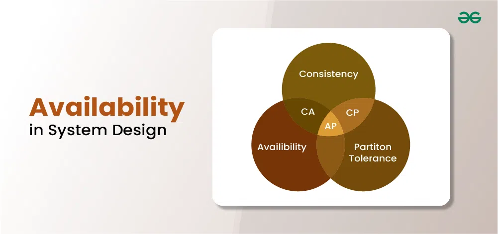

Availability in System Design
=============================

Last Updated : 14 Mar, 2024

In [system design](https://www.geeksforgeeks.org/what-is-system-design-learn-system-design/), availability refers to the proportion of time that a system or service is operational and accessible for use. It is a critical aspect of designing reliable and resilient systems, especially in the context of online services, websites, cloud-based applications, and other mission-critical systems.

Important Topics for Availability in System Design

*   [What is Availability?](#what-is-availability)
*   [How is availability measured?](#how-is-availability-measured)
*   [Why is Availability Important in System Design?](#why-is-availability-important-in-system-design)
*   [How do we achieve high availability?](#how-do-we-achieve-high-availability)
*   [Difference between Availability and Fault Tolerance](#difference-between-availability-and-fault-tolerance)

What is Availability?
---------------------

Availability refers to the readiness and accessibility of a system or service to users at any given time. It measures the percentage of time a system remains operational and usable. High availability ensures that users can access the system without significant interruptions or downtime, typically achieved through redundancy, fault tolerance, and efficient recovery mechanisms.

**How is availability measured?**
---------------------------------

Availability is usually measured as a percentage and is often expressed in terms of “uptime” versus “downtime” over a given period. For instance, a system with 99% availability means it is expected to be operational and accessible 99% of the time, while the remaining 1% represents the allowable downtime.

Why is Availability Important in System Design?
-----------------------------------------------

1.  **User Experience:** Availability ensures that users can access the system and its services when needed, leading to a positive user experience. Systems that are frequently unavailable or experience downtime frustrate users and may lead to dissatisfaction, loss of trust, and even abandonment of the system in favor of alternatives.
2.  **Business Continuity:** Availability is essential for maintaining business continuity and ensuring uninterrupted operations. For businesses that rely on their systems to deliver services or conduct transactions, even brief periods of downtime can result in significant financial losses, damage to reputation, and legal liabilities.
3.  **Service Level Agreements (SLAs):** Many organizations commit to meeting specific availability targets through SLAs with their customers or stakeholders. Failure to meet these SLAs can result in financial penalties or contractual obligations. Therefore, designing systems with high availability is crucial for meeting SLA requirements and maintaining customer satisfaction.
4.  **Competitive Advantage:** High availability can be a competitive differentiator for businesses, particularly in industries where uptime and reliability are critical factors. Systems that offer better availability compared to competitors are more likely to attract and retain customers, leading to a competitive advantage in the market.
5.  **Disaster Recovery:** Availability is closely related to disaster recovery and resilience. Designing systems with redundancy, failover mechanisms, and disaster recovery plans ensures that the system can withstand and recover from unexpected events such as hardware failures, network outages, natural disasters, or cyberattacks.
6.  **Regulatory Compliance:** In many industries, there are regulatory requirements or standards that mandate a minimum level of system availability. Failure to comply with these regulations can result in legal consequences, fines, or sanctions. Therefore, designing systems with high availability is essential for ensuring regulatory compliance.

**How do we achieve high availability?**
----------------------------------------

High availability is essential for systems where continuous operation is vital, and any disruption could lead to financial losses, reputational damage, or even safety hazards. Commonly, systems with high availability requirements include banking applications, e-commerce platforms, healthcare systems, emergency response services, and cloud infrastructure.

System designers implement various strategies and technologies to achieve high availability, such as:

*   **Redundancy:** Employ redundant components or servers to ensure that another can take over seamlessly if one fails. This can include redundancy at different levels, such as hardware, networking, and data centers.
*   **Load balancing:** Distributing incoming requests across multiple servers or resources to prevent overload on any single component and improve overall system performance and fault tolerance.
*   **Failover mechanisms:** Implementing automated processes to detect failures and switch to redundant systems without manual intervention.
*   **Disaster Recovery (DR):** Having a comprehensive plan in place to recover the system in case of a catastrophic event that affects the primary infrastructure.
*   **Monitoring and Alerting:** Implementing robust monitoring systems that can detect issues in real-time and notify administrators to take appropriate action promptly.
*   **Performance optimization:** Ensuring that the system is designed and tuned to handle the expected load efficiently, reducing the risk of bottlenecks and failures.
*   **Scalability:** Designing the system to scale easily by adding more resources when needed to accommodate increased demand.

**Difference between Availability and Fault Tolerance**
-------------------------------------------------------

Below are the differences between the availability and fault tolerance:

**Aspect**

**Availability**

**Fault Tolerance**

**Definition**

The proportion of time a system is operational and accessible for use.

The ability of a system to continue functioning, albeit with reduced performance, in the presence of faults or failures.

**Goal**

Maximizing the system’s uptime and minimizing downtime.

Ensuring the system remains operational despite hardware, software, or network failures

**Focus**

Emphasizes continuous and consistent access to services.

Focuses on the system’s ability to handle and recover from failures.

**Measures**

Typically expressed as a percentage of uptime over a specific period (e.g., 99.9% uptime per month).

It is usually expressed in terms of Mean Time Between Failures (MTBF) and Mean Time to Recover (MTTR).

**Strategies**

Redundancy, load balancing, failover mechanisms, disaster recovery planning, etc.

Use of redundant components, data replication, failover mechanisms, and graceful degradation of performance in case of faults.

**Goal Achievement**

High availability is achieved by minimizing the impact of potential failures.

Fault tolerance is achieved by detecting and recovering from failures in a way that doesn’t lead to system-wide outages.

**User Experience**

Focuses on providing a consistent and reliable user experience with minimal disruption.

Focuses on maintaining the overall system functionality and preventing complete system failures.

**Use Cases**

Critical for systems that need to be accessible and operational at almost all times (e.g., e-commerce, banking).

Important in safety-critical systems, aerospace, healthcare, and other scenarios where system failure can lead to severe consequences.

**Redundancy Level**

High availability may involve some redundancy, but it may not eliminate all single points of failure.

Fault tolerance often requires a higher degree of redundancy to provide backup mechanisms for various components.

  

  

[Previous](https://www.geeksforgeeks.org/system-design-horizontal-and-vertical-scaling/?ref=previous_article)

[Horizontal and Vertical Scaling | System Design](https://www.geeksforgeeks.org/system-design-horizontal-and-vertical-scaling/?ref=previous_article)

[Next](https://www.geeksforgeeks.org/consistency-in-system-design/?ref=next_article)

[Consistency in System Design](https://www.geeksforgeeks.org/consistency-in-system-design/?ref=next_article)
