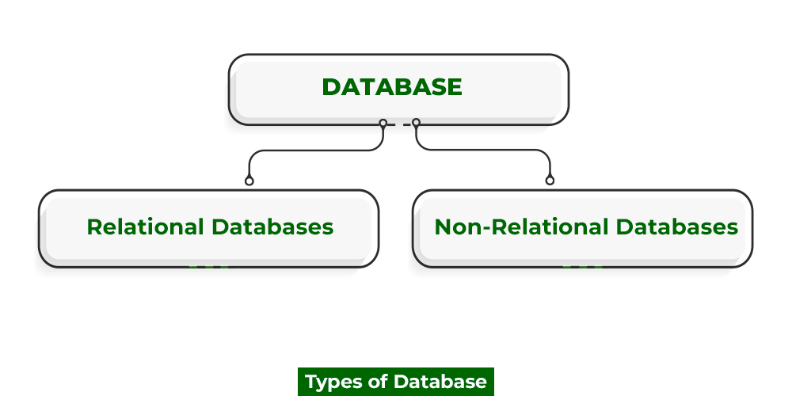
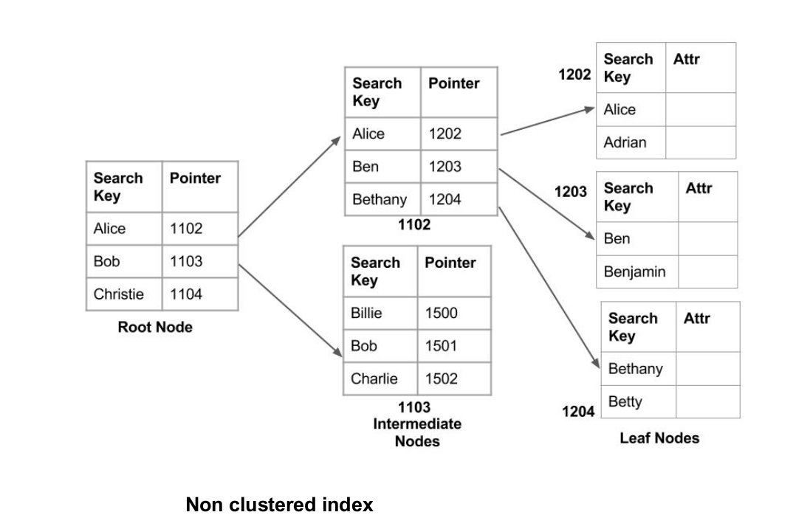

 Complete Reference to Databases in Designing Systems – Learn System Design
==========================================================================

  Last Updated :  09 Jun, 2023     **Previous Parts of this System Design Tutorial**

1. [What is System Design](https://www.geeksforgeeks.org/what-is-system-design-learn-system-design/?utm_source=gfg&utm_medium=prerequisites+click&utm_campaign=system+design+tracker&utm_term=system+design+promo&utm_content=scalability-in-sd)
2. [Analysis of Monolithic and Distributed Systems](https://www.geeksforgeeks.org/analysis-of-monolithic-and-distributed-systems-learn-system-design/?utm_source=gfg&utm_medium=prerequisites+click&utm_campaign=system+design+tracker&utm_term=system+design+promo&utm_content=scalability-in-sd)
3. [Important Key Concepts and Terminologies](https://www.geeksforgeeks.org/important-key-concepts-and-terminologies-learn-system-design/?utm_source=gfg&utm_medium=prerequisites+click&utm_campaign=system+design+tracker&utm_term=system+design+promo&utm_content=scalability-in-sd)
4. [What is Scalability and How to achieve it](https://www.geeksforgeeks.org/what-is-scalability-and-how-to-achieve-it-learn-system-design/?utm_source=newgfgui&utm_medium=gblog&utm_campaign=newhomepage)

What is a Database?
--------------------------

> When we store data, information, or interrelated data, in an organized manner in one place, it is known as **Database**.

Databases are responsible for the storage and retrieval of data from a data application. They are an essential part as all the information is stored inside them so getting their design principle understanding is crucial as with rising in big data several activities that involve our interaction with databases.

Complete Reference to Databases in Designing Systems – Learn System Design

### Terminologies used in the Database:

- **Data:** Any statistics which is raw and unprocessed are referred as Data.
- **Information:** When data is processed, it is known as Information. This is because information gives an idea about what the data is about, how to use it further, and so on.
- **Database:** When we store data, information, or interrelated data, in an organized manner in one place, it is known as Database.
- **DBMS or Database Management System:** A system developed add, edit, and manage various databases in a collection is known as DBMS.
- **Transactions**: Any CRUD operation performed on a database is referred to as a Transaction in Database. Every transaction in Database must follow [ACID property](https://www.geeksforgeeks.org/acid-properties-in-dbms/).

Transaction States in DBMS

Now we are good to go with discussing types of databases first in-depth so as to understand when, why and which database to opt for designing purposes.

[Types of Databases](https://www.geeksforgeeks.org/types-of-databases/)
------------------------------------------------------------------------------

They are of 3 types as follows as listed and shown below media as follows:

1. File-Based DBMS (flat file form)
2. Relational DBMS (tabular form)
3. Non-relational DBMS (Non-tabular form)

Types of Databases

Databases Basics In System Designing
-------------------------------------------

Role of Database in System Design

> **Pre-requisite:** [CAP theorem](https://www.geeksforgeeks.org/the-cap-theorem-in-dbms/) which states that it is not possible to guarantee all three of the desirable properties – consistency, availability, and partition tolerance at the same time in a distributed system with data replication.
> 
> 1. **Consistency:** All nodes in the system should be responding with the most recent data.
> 2. **Availability:** Any node can send a response.
> 3. **Partial Tolerance:** Systems will keep on working even if communication is dropped between 2 nodes.

Now we are good to go to discuss the above database sets as depicted below:

### **CP database**

In this database when partitioning between any two nodes is happening a;; other non-consistent nodes are shut down hence making them unavailable. This database delivers consistency and partition tolerance at expense of availability.

CP Database

### **AP database**

As the name suggests consistency is getting lost in this database during partitioning all nodes at the wrong end of partition are made to deliver older version of data. In this way in this database, all nodes are available but not consistent.

AP Database

> **Note:** Now you must be wondering about CA database which sounds misleading as there is no partitioning carried on. So always remember partitioning is a property of a system which is telling CP or AP, which one to choose .

CA, AP and CP Databases

> **Interesting fact:** We see RDBMS databases at CA sides of triangle in above media which is only possible at single node setup as even in case of master(write)-slave(read).
> 
> **Note:** Sometimes when it is only referred to as CA to lower degree of extent for some reasons where it can’t recover from network partitions than there split-bran scenario.(new master is elected for partitioning)

Blob Storage
-------------------

Let us say we are up to [**designing a Uber system**](https://www.geeksforgeeks.org/system-design-of-uber-app-uber-system-architecture/) where we are up to the booking, renting cabs, and many other services.

Now here the consumer will be dropping text so as in order to easily communicate or call or worst dropping a nearby images where he/she wants to go. So as a driver can be there either by online call service or dropped image landed for which we will be needing databases to store the images.

> Wherever in a system we are having images and videos they are not directly termed as databases and rather are referred to as **Blob storages** because we are directly putting them. So in order to work, no queries can be operated over them.

The below media depicts the system architecture of the Uber app as follows in order to get showcasing data stores and to get an overview of database design:

System Design Of the Uber App

> Note: Amazon S3 is one of the top providers serving as data storage, also known as blob storage.

**CDN(Content Delivery Network):** Images and videos that are stored in datastores (Amazon S3)now need to be widespread across different servers across the globe because there are humongous users that are querying for the same as compared to databases widespread across in accordance to geographical locations.

> Blob = S3(Datastore) + CDN(Content Delivery Network)

**Text Search Engine Capabilities:** Now we want users to interact with the service then we need to provide searching via text of title and description. Here in order to aid searching common search engine capabilities which are seen in many system architectures such as Google Maps, Amazon Prime, and many more that we can easily think of. Now, this commonly is provided by [Elastic search and Solr](https://www.geeksforgeeks.org/difference-between-elasticsearch-and-solr/) of which both are built on top of **Apache Lucene.**

Now think of what will happen if the user enters grammatically wrong words while searching how a text search engine will be working is as shown below as follows:

**Fuzzy Search:** It is assistance played alongside text search capabilities where the user enters grammatically wrong while typing corresponding if we do not fetch any query result will lead to bad user capabilities. Hence we make our database smart with this technique by showcasing nothing.

Now let us consider a sample system design be it Google, or Amazon where we want to store the database for analytics on all the transactions as per the system’s current or ongoing requirements then we do it a different way. Here we keep a larger chunk over all databases which is commonly known as [data warehousing](https://www.geeksforgeeks.org/data-warehousing/).

**Data Warehousing:** It is introduced where all the data is dumped into the database so as to serve various queering capabilities to generate reports. Data warehousing is generally not computed over online data but computed over offline data.

Example: Hadoop

How to select the right database for the service?
--------------------------------------------------------

It is a very crucial step when it comes to databases in designing systems. In order to get the right database for our data, we need to first look over 5 factors that are as follows:

1. Structure of Data
2. Pattern query
3. Amount of scalability
4. Cost
5. Maturity of the database

### When we to use relational and non-relational database in system?

When we are having structured data(tabular data) than using relational database is optimal because here the data is in form of rows and columns and can easily be stored. Popular examples: MySQL, oracle, postgres, SQL server.

But if we do not need ACID properties than it is upto us which one to choose as per the requirements.

Choosing a database is depicted in a flowchart below as follows:

How to Choose Right Database for our System

> **Note:** If we do not need ACID properties , nor do wide variety query types and neither our data is ever increasing than it directly implies it is a low scaled system with lesser number of attributes over small data set where we can opt for any of either datatypes.

Now let us compare via tabular format below as follows in order to choose the best database as per our system design so that we are clear.

**Challenges to databases while Scaling**
------------------------------------------------

We are facing a problem of increased cost for query operations no matter what the type of database. It is because the CPU is responsible for query operation whereas our data is stored in hard disk(secondary memory). Now CPU is computing a million input per second (MIPS) whereas our hard disk is only doing &lt;100 operations per second no matter how fast it be. So they cannot interact with each other directly but have to correspond to which we bring primary memory (RAM) into play which can operate faster via **caching but it is not optimized** as perceived from the below media:

Relation between CPU and memories In a Computer

As seen above data is stored across sectors(blocks) in our secondary memory and can not be fully transferred to RAM else it will be lost completely as studied in the operating system we pay a cost every time while dealing without data.

How to overcome challenges to Databases while Scaling 
-------------------------------------------------------------

Now let us discuss below concepts that help us in scaling our databases and overcoming these challenges that are as follows:

1. Indexing
2. Data Partitioning
3. Database Sharding

Let us first discuss indexing followed by indexing and partitioning/ sharding.

**What is Indexing?**
---------------------

Indexing is a procedure introduced for database operations and other queries (received by CPU) are optimized by reducing the amount of time needed to complete a query, indexing helps optimize queries and other database processes while fetching data in lesser time. The indexes are stored using the B-tree data structure. Only utilize indexing if the data is massive and the application requires a lot of reading. Indexing may slow down write operations if an application is write-intensive.


### **How indexing helps in reducing costs?**

The data is fetched from secondary memory in blocks as studied in OS. Note here data can be structured or non-structured. At the backend, the storage manager in OS does the job by putting all the data from logical drives into secondary memory in multiple chunks of blocks known as sectors. Now, these blocks are fetched into main memory(RAM) where we are not focusing on reducing the block size or changing it.

Here in indexing when a single block is inserted in RAM at once and retrieval of data occurs. If the answer to the desired query is fetched then it is called ‘cache-hit’ else it is known as ‘cache=miss’.

> **Tip:** There is a cost associated with this cache hit-miss operation known as **I/O cost**.

In this way instead of rolling the complete data into RAM which takes an enormous amount of time as a cost in designing the model, with indexing the same data can be fetched just likely what we have had in books.

**Illustration:**

```
SELECT * from GFGEmployees where Name = Mayank Solanki;
```

Now if we do not apply to index we have to put the whole record from the organization directory to RAM for just a basic query while with help of indexing no matter how big the organization scales up cache hit-and-miss operations drastically reduce the cost not only for this query but even to complex ones as there will be only hit or miss operation. If fetched, hit else cache-miss.

**Example:**

Indexing in a Table In a Database

> **Note:** Indexing and hashing in a database are very important from an interview perspective as it is been asked in many system design interview.

### **Advantages of Indexing**

Indexing has several benefits, including

- Faster SELECT queries.
- Makes a row distinctive or helps to eliminate duplicates from a row.
- We can search against huge string values for full-text indexes, such as locating the string for a substring.

### **Disadvantages of Indexing**

- The update process is speed up if the where conditions refer to an indexed field, but the Insert, Update, and Deletes query is slowed down because the index must also be updated while updating.
- Extra room is needed for the indexing parts.

Now after having an understanding of the concept of indexing let us adhere forward to the concept of partitioning.

What is Data partitioning?
---------------------------------

It is a database procedure of partitioning that involves breaking up a very large table into a number of smaller sections. Queries that access only a tiny portion of the data can run faster since there is fewer data to scan when huge tables are divided into smaller individual tables. When the amount of data is large and a single system cannot handle it, partitioning is used.

Now let us discuss different methods of achieving partitioning that is as follows:

### **Partitioning Methods**

There are 3 types of partitioning that are listed below and later discussed as follows:

1. Horizontal Partitioning
2. Vertical Partitioning
3. Directory based Partitioning

Let us discuss them in detail for better understanding as follows:

**1. Horizontal Partitioning:** Without the need to make separate tables for each portion, horizontal partitioning divides big tables into smaller, more manageable pieces. A partitioned table’s data is physically kept in row groups known as partitions. It is possible to access and save each partition independently. In horizontal partitioning, each shard has the same schema as the parent database.

Application: Zipcode

> **Note:** It is also known as shading or sometimes referred as range-based partitioning.

**2. Vertical Partitioning:** Tables with fewer columns are created using the vertical partitioning technique, and the remaining columns are stored in new tables. Data is presented in a vertical format.

The main purpose of vertical table partitioning is to increase SQL Server speed, particularly when a query needs to fetch all columns from a database with a lot of text or BLOB columns.

Application: Large Reports(be it of any domain)

**3. Directory-based Partitioning:** A search function that is aware of the partitioning structure and decouples it from the database access code. It enables modifying the partitioning scheme or adding new database servers without impacting the application. It results in a horizontally scalable application that is loosely connected. Since key-based partitioning requires the use of a hash function that cannot be often updated.

- Directory-based partitioning is more adaptable than key-based or range-based partitioning.
- Range-based partitioning establishes range values that cannot be changed.

However, since directory-based partitioning is a more dynamic method and is therefore more flexible, we can use any technique to assign data to the shards.

> Now geeks you must be wondering what is the criteria behind above discussed methods of partitioning. So let us do discuss them now to get grasp understanding over concept of partitioning that is as follows:

### **Partition Criteria:**

1. **Key or Hash-based Robin Partitioning:** To determine the partition number, we apply the hash function to the entry’s key attribute.
2. **List Robin Partitioning:** The column that corresponds to one of the sets of discrete values is used to choose which partition to use. A set of appropriate values is assigned to the specific partition.
3. **Round Robin Partitioning:** The i<sup>th</sup> tuple is assigned to partition number i%n if there are n partitions. This implies that (i%n) nodes would receive the ith data. Sequential assignments are made to the data. The distribution of data is guaranteed by this partitioning criterion.
4. **Consistent hashing:** This form of division is novel. The hash-based partitioning had the drawback of requiring a change in the hash function when adding new servers. A server outage and data redistribution would result from changing the hash function.

### **Advantages of Partitioning:**

- Performance Optimization
- Availability
- Load Balancing
- Scalability
- More manageable

### **Disadvantages of Partitioning:**

- The complexity of the software must be maintained, including the logic for routing inquiries and aggregating compute results.
- Additional hardware management: more DevOps work.
- Additional overhead when redundancy.

What is Sharding?
-----------------

Sharding is a very important concept that helps the system to keep data in different resources according to the sharding process. The word “Shard” means “a small part of a whole“. Sharding means dividing a larger part into smaller parts. In DBMS, Sharding is a type of database partitioning in which a large Database is divided or partitioned into smaller data and different nodes. These shards are not only smaller, but also faster and hence easily manageable.

**Illustration:** Now let us consider two scenarios where there is no sharding and in other, we will be having simple sharding via medias to understand it better as follows:

- Case 1: No Sharding

No sharding

- Case 2: Simple Sharding

.png)


### **Need for Sharding**

Consider a very large database whose sharding has not been done. For example, let’s take a Database of a college in which all the student records (present and past) in the whole college are maintained in a single database. So, it would contain a very large number of data, say 100, 000 records. Now when we need to find a student from this Database, each time around 100, 000 transactions have to be done to find the student, which is very very costly.

Sharding Of A Database

Now consider the same college students’ records, divided into smaller data shards based on years. Now each data shard will have around 1000-5000 students’ records only. So not only the database became much more manageable, but also the transaction cost each time also reduces by a huge factor, which is achieved by Sharding. Hence this is why Sharding is needed.

### **Features of sharding:**

1. Sharding makes the Database smaller
2. Sharding makes the Database faster
3. Sharding makes the Database much more easily manageable
4. Sharding can be a complex operation sometimes
5. Sharding reduces the transaction cost of the Database
6. Each shard reads and writes its own data.
7. Many NoSQL databases offer auto-sharding.
8. Failure of one shard doesn’t affect the data processing of other shards.

  
   
 [  Previous ](https://www.geeksforgeeks.org/primary-bottlenecks-that-hurt-the-scalability-of-an-application-system-design/?ref=previous_article)  [Primary Bottlenecks that Hurt the Scalability of an Application | System Design](https://www.geeksforgeeks.org/primary-bottlenecks-that-hurt-the-scalability-of-an-application-system-design/?ref=previous_article)   [ Next  ](https://www.geeksforgeeks.org/which-database-to-choose-while-designing-a-system-sql-or-nosql/?ref=next_article)  [SQL vs NoSQL: Which Database to Choose in System Design?](https://www.geeksforgeeks.org/which-database-to-choose-while-designing-a-system-sql-or-nosql/?ref=next_article)    
