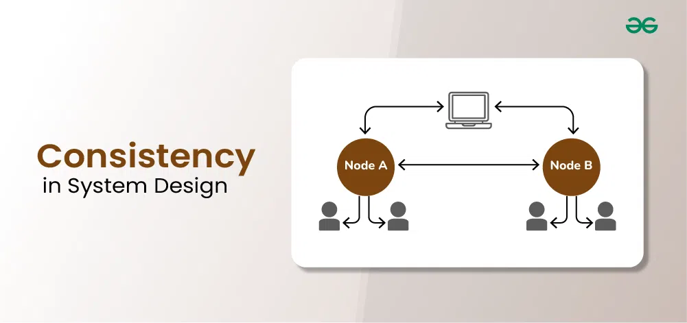
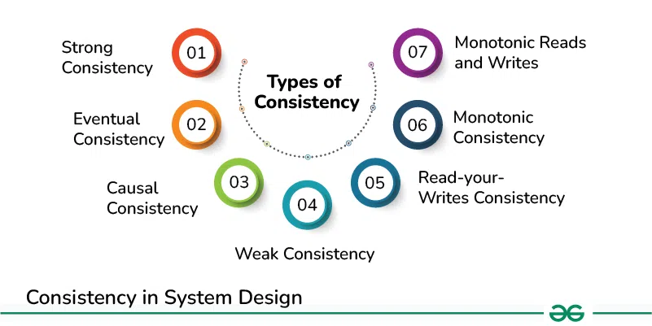

Consistency in System Design
============================

Last Updated : 01 Mar, 2024

Consistency in system design refers to the property of ensuring that all nodes in a distributed system have the same view of the data at any given point in time, despite possible concurrent operations and network delays. In simpler terms, it means that when multiple clients access or modify the same data concurrently, they all see a consistent state of that data.

Important Topics for the Consistency in System Design

*   [Importance of Consistency in System Design](#importance-of-consistency-in-system-design)
*   [Types of Consistency](#types-of-consistency)
*   [Challenges to Consistency](#challenges-to-consistency)
*   [Strategies for achieving Consistency](#strategies-for-achieving-consistency)

Importance of Consistency in [System Design](https://www.geeksforgeeks.org/what-is-system-design-learn-system-design/)
----------------------------------------------------------------------------------------------------------------------

Consistency plays a crucial role in system design for several reasons:

*   **Correctness:** Consistency ensures that the data accessed by different parts of the system is always accurate and reflects the latest state of affairs. This is essential for ensuring that the system behaves as expected and produces correct results.
*   **Reliability:** Consistent systems are more reliable because they reduce the risk of errors and inconsistencies that can lead to unpredictable behavior or data corruption. Users can trust the system to provide accurate and dependable results.
*   **Data Integrity:** Consistency helps maintain the integrity of the data stored in the system. By ensuring that all updates are correctly applied and propagated, consistency helps prevent data corruption and loss.
*   **Concurrency Control:** In multi-user or distributed systems where multiple clients may access and modify the same data concurrently, consistency mechanisms help control access to prevent conflicts and ensure that changes are applied in a coordinated manner.
*   **User Experience:** Consistency enhances the user experience by providing a predictable and seamless interaction with the system. Users can rely on the system to present them with coherent and up-to-date information, leading to greater satisfaction and usability.

Types of Consistency
--------------------

### 1\. [Strong Consistency](https://www.geeksforgeeks.org/strong-consistency-in-system-design/)

Strong Consistency also known as linearizability or strict consistency, this type guarantees that every read operation receives the most recent write operation’s value or an error. It ensures that all clients see the same sequence of updates and that updates appear to be instantaneous. Achieving strong consistency often requires coordination and synchronization between distributed nodes, which can impact system performance and availability.

**Example:**

> A traditional SQL database system with a single master node and multiple replicas ensures strong consistency. When a client writes data to the master node, subsequent reads from any replica will immediately reflect the latest value written. All replicas are updated synchronously, ensuring that all clients see a consistent view of the data.

### 2\. [Eventual Consistency](https://www.geeksforgeeks.org/eventual-consistency-in-distributive-systems-learn-system-design/)

Eventual consistency allows replicas of data to diverge temporarily but ensures that they will eventually converge to the same value. It relaxes the consistency requirements, allowing for improved availability and performance in distributed systems. While eventual consistency may lead to temporary inconsistencies, it guarantees that all updates will be eventually propagated and reconciled.

**Example:**

> Amazon’s DynamoDB, a distributed NoSQL database, provides eventual consistency. When data is written to DynamoDB, it is initially stored locally on a single node and then asynchronously propagated to other nodes in the system. While clients may read slightly outdated values immediately after a write, all replicas eventually converge to the same value over time.

### 3\. [Causal Consistency](https://www.geeksforgeeks.org/causal-consistency-model-in-system-design/)

Causal consistency preserves the causality between related events in a distributed system. If event A causally precedes event B, all nodes in the system will agree on this ordering. Causal consistency ensures that clients observing concurrent events maintain a consistent view of their causality relationship, which is essential for maintaining application semantics and correctness.

**Example:**

> A collaborative document editing application, where users can concurrently make edits to different sections of a document, requires causal consistency. If user A makes an edit that depends on the content written by user B, all users should observe these edits in the correct causal order. This ensures that the document remains coherent and maintains the intended meaning across all users.

### 4\. Read-your-Writes Consistency

This type of consistency guarantees that after a client writes a value to a data item, it will always be able to read that value or any subsequent value it has written. It provides a stronger consistency guarantee for individual clients, ensuring that they observe their own updates immediately. Read-your-writes consistency is important for maintaining session consistency in applications where users expect to see their own updates reflected immediately.

**Example:**

> A social media platform ensures read-your-writes consistency for users’ posts and comments. After a user publishes a new post or comment, they expect to immediately see their own content when viewing their timeline or profile. This consistency model ensures that users observe their own updates immediately after performing a write operation.

### 5\. Monotonic Consistency

Monotonic consistency ensures that if a client observes a particular order of updates (reads or writes) to a data item, it will never observe a conflicting order of updates. Monotonic consistency prevents the system from reverting to previous states or seeing inconsistent sequences of updates, which helps maintain data integrity and coherence.

**Example:**

> A distributed key-value store maintains monotonic consistency by guaranteeing that once a client observes a particular sequence of updates, it will never observe a conflicting sequence of updates. For instance, if a client reads values A, B, and C in that order, it will never later observe values C, A, and B.

### 6\. Monotonic Reads and Writes

These consistency guarantees ensure that if a client performs a sequence of reads or writes, it will observe a monotonically increasing sequence of values or updates. Monotonic reads ensure that clients never see older values in subsequent reads, while monotonic writes guarantee that writes from a single client are applied in the same order on all replicas.

**Example:**

> Google’s Spanner, a globally distributed relational database, ensures monotonic reads and writes consistency. When a client reads or writes data, it observes a monotonically increasing sequence of values or updates. This guarantees that clients always see the most recent data and that writes are applied in the same order across all replicas.

### 7\. Weak Consistency

Weak consistency provides the weakest guarantee among consistency models. It allows for significant divergence between replicas and only guarantees that updates will eventually propagate to all replicas. Unlike eventual consistency, which ensures convergence, weak consistency does not provide any guarantees about when or if replicas will converge. Instead, it allows for concurrent updates and may result in temporary inconsistencies. Weak consistency is often used in systems where low latency and high availability are prioritized over strict consistency.

**Example:**

> A distributed caching system, such as [Redis](https://www.geeksforgeeks.org/introduction-to-redis-server/) or Memcached, often implements weak consistency. In such systems, data is stored and retrieved quickly from an in-memory cache, but updates may be asynchronously propagated to other nodes. This can lead to temporary inconsistencies where clients may observe old or divergent values until updates are fully propagated.

**Note:** However, weak consistency enables high performance and scalability for caching frequently accessed data.

Challenges to Consistency
-------------------------

### Scalability Issues

*   **Coordination Overhead**
    *   Consistency often requires coordination among distributed nodes, which introduces overhead as the system scales. Synchronous coordination mechanisms, such as distributed locking or two-phase commit protocols, can become bottlenecks, impacting system scalability.
*   **Latency**
    *   Strong consistency models may require waiting for acknowledgments from multiple nodes before completing a write operation, increasing latency. As the system scales geographically or in terms of the number of clients, this latency can become more pronounced, affecting user experience.
*   **Contention**
    *   In highly concurrent systems, contention for resources like locks or coordination points can arise, leading to performance degradation and scalability issues. As the number of clients or transactions increases, contention can worsen, hindering system scalability.

### Human Factors

*   **Developer Understanding**
    *   Consistency models can be complex, and developers may have varying levels of understanding of their implications. Inconsistent interpretation or implementation of consistency models across different parts of a system can lead to unintended behavior and inconsistencies.
*   **Operational Complexity**
    *   Ensuring consistency often involves configuring and managing complex distributed systems. Human error in configuring replication settings, consistency levels, or coordination mechanisms can lead to data inconsistencies or performance issues.
*   **Testing and Debugging**
    *   Verifying and debugging consistency-related issues in distributed systems can be challenging. Testing for consistency guarantees across different scenarios and failure modes requires sophisticated testing strategies and tools, increasing the complexity of development and maintenance.

### Cross-Platform Consistency

*   **Heterogeneous Environments**
    *   Maintaining consistency across different platforms, such as mobile devices, web browsers, and server-side systems, can be challenging due to differences in network connectivity, storage capabilities, and execution environments.
*   **Data Synchronization**
    *   Ensuring consistency of data across multiple platforms and devices requires robust synchronization mechanisms. Asynchronous updates, network delays, and device-specific constraints can introduce complexities in synchronizing data reliably across platforms.
*   **Concurrency Control**
    *   Coordinating concurrent access to shared data across different platforms while maintaining consistency requires careful design and implementation of concurrency control mechanisms. Conflicts between updates from different platforms need to be detected and resolved to ensure data integrity and coherence.

Strategies for achieving Consistency
------------------------------------

Achieving consistency in distributed systems involves employing various strategies, including design patterns, consistency models, conflict resolution techniques, and best practices. Here’s an overview of each:

### [Design Patterns](https://www.geeksforgeeks.org/software-design-patterns/) and Best Practices

*   **Single Source of Truth:** Design systems with a single authoritative source of truth for critical data. This reduces the potential for inconsistencies arising from multiple conflicting sources.
*   **Unchanged Operations:** Design operations that can be applied multiple times without changing the result. Idempotent operations are essential for ensuring consistency in the face of network failures and retries.
*   **Versioning:** Implement versioning mechanisms for data objects to track changes over time. Versioning helps in detecting conflicts and resolving inconsistencies.
*   **Transaction Management:** Use transactional operations to group related updates into atomic units of work. Transactions ensure that either all updates are applied successfully or none are, maintaining data consistency.
*   **Asynchronous Updates:** Decouple components by employing asynchronous communication patterns. Asynchronous updates reduce contention and improve scalability by allowing components to process updates independently.

### Consistency Models

*   **Eventual Consistency:** Embrace eventual consistency for scenarios where immediate consistency is not required. Allow replicas to diverge temporarily but ensure eventual convergence to a consistent state.
*   **Strong Consistency:** Utilize strong consistency models when strict consistency is necessary for correctness, such as in financial transactions or critical system operations. Ensure that all updates are immediately visible to all clients.
*   **Causal Consistency:** Apply causal consistency for preserving causal relationships between events in distributed systems. Ensure that events causally related are observed in the correct order across all replicas.

### Conflict Resolution Techniques

*   **Last-Writer-Wins (LWW):** Resolve conflicts by favoring the update with the latest timestamp or version. LWW is a simple conflict resolution strategy but may lead to data loss or inconsistency in some scenarios.
*   **Merge Strategies:** Use custom merge strategies or conflict resolution algorithms tailored to the specific requirements of the application domain. Merge strategies reconcile conflicting updates based on application-specific semantics and user preferences.

  

  

[Previous](https://www.geeksforgeeks.org/availability-in-system-design/?ref=previous_article)

[Availability in System Design](https://www.geeksforgeeks.org/availability-in-system-design/?ref=previous_article)

[Next](https://www.geeksforgeeks.org/reliability-in-system-design/?ref=next_article)

[Reliability in System Design](https://www.geeksforgeeks.org/reliability-in-system-design/?ref=next_article)
