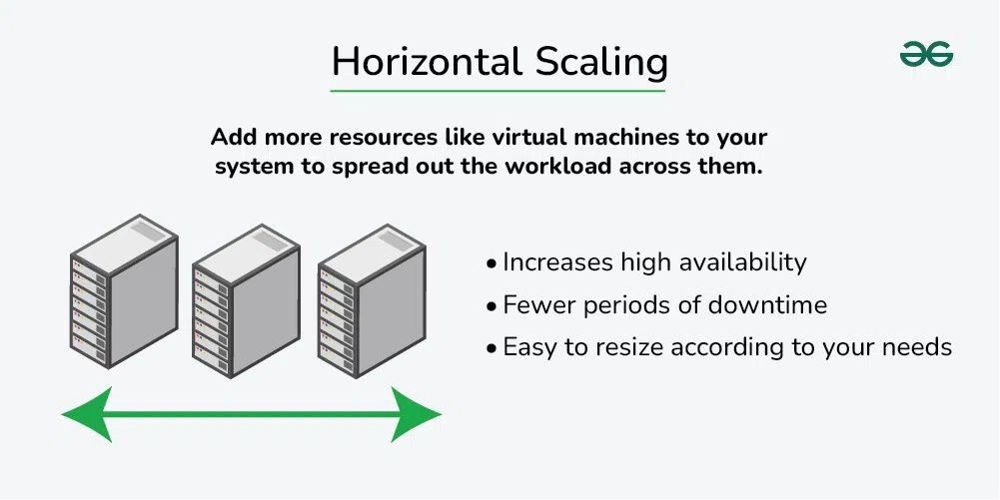

Horizontal and Vertical Scaling | System Design
===============================================

Last Updated : 08 Feb, 2024

In today’s fast-paced digital world, creating systems that can handle increasing demands is key to success. Picture this: you’re hosting a big party, and more and more guests keep arriving. You need to make sure your setup can handle the crowd without slowing down or crashing.

In this article, we’ll break down the concepts of horizontal and vertical scaling and see why they’re essential for building systems that can handle the ever-growing demands of the digital world.

> **Horizontal scaling** and **vertical scaling** are two different approaches to scaling a system, both of which can be used to improve the performance and capacity of the system.

Important Topics for the Horizontal and Vertical Scaling

- [Horizontal and Vertical Scaling | System Design](#horizontal-and-vertical-scaling--system-design)
  - [What is Scalabilty?](#what-is-scalabilty)
  - [What is Vertical Scaling?](#what-is-vertical-scaling)
    - [Characteristics of the Vertical Scaling](#characteristics-of-the-vertical-scaling)
    - [Advantages of vertical scaling](#advantages-of-vertical-scaling)
    - [Disadvantages of vertical scaling:](#disadvantages-of-vertical-scaling)
  - [What is Horizontal Scaling?](#what-is-horizontal-scaling)
    - [Characteristics of the horizontal scaling](#characteristics-of-the-horizontal-scaling)
    - [Advantages of horizontal scaling](#advantages-of-horizontal-scaling)
    - [Disadvantages of horizontal scaling](#disadvantages-of-horizontal-scaling)
  - [Differences between Horizontal and Vertical Scaling](#differences-between-horizontal-and-vertical-scaling)
  - [Which scaling option is right for an application?](#which-scaling-option-is-right-for-an-application)

What is [Scalabilty](https://www.geeksforgeeks.org/what-is-scalability-and-how-to-achieve-it-learn-system-design/)?
-------------------------------------------------------------------------------------------------------------------

Scalability refers to the ability of a system to handle increasing amounts of workload or requests without sacrificing performance or incurring excessive costs.

> It’s crucial to understand scalability in system design because it directly impacts the system’s ability to grow and adapt to changing requirements over time. Failing to design for scalability can lead to bottlenecks, performance issues, and ultimately, system failures as demand increases.

There are two main types of scalability:

*   **Vertical scaling or Scale-up**
*   **Horizontal scaling or Scale-out**

Vertical scaling involves increasing the capacity of a single machine, while horizontal scaling involves adding more machines to distribute the workload. Each approach has its advantages and challenges, and the choice between them depends on factors such as cost, performance requirements, and the nature of the workload.

Let’s understand what is Horizontal Scaling and Vertical Scaling :

What is Vertical Scaling?
-------------------------

Vertical scaling, also known as scaling up, refers to the process of increasing the capacity or capabilities of an individual hardware or software component within a system. You can add more power to your machine by adding better processors, increasing RAM, or other power-increasing adjustments. Vertical scaling aims to improve the performance and capacity of the system to handle higher loads or more complex tasks without changing the fundamental architecture or adding additional servers.

> Imagine you have a computer at home that you use for various tasks such as web browsing, word processing, and light gaming. Over time, you find that your computer struggles to keep up with more resource-intensive tasks like video editing or running advanced software.

*   To address this issue, you decide to upgrade your existing computer by adding more powerful components such as a faster processor, additional RAM, or a larger hard drive.
*   By doing so, you’re vertically scaling your system, increasing its capacity to handle more demanding tasks.

### Characteristics of the Vertical Scaling

*   This approach is also known as the ‘**scale-up**‘ approach.
*   It doesn’t require any partitioning of data and all the traffic resides on a **single node with more resources**.
*   Its implementation is easy.
*   Less administrative effort as you need to manage just one system.
*   Application compatibility is maintained.
*   Mostly used in small and mid-sized companies.
*   MySQL and Amazon RDS is a good examples of vertical scaling.

### Advantages of vertical scaling

*   **Increased capacity:** Upgrading the hardware of a server can improve its performance and increase its capacity to handle incoming requests.
*   **Easier management:** Vertical scaling typically involves upgrading a single node, which can be less complex than managing multiple nodes.

### Disadvantages of vertical scaling:

*   **Limited scalability:** Vertical scaling is limited by the physical constraints of the hardware, whereas horizontal scaling can be easily expanded by adding more nodes.
*   **Increased cost:** Upgrading the hardware of a server can be more expensive than adding more nodes.
*   **Single point of failure:** All incoming requests are still directed to a single server, which increases the risk of downtime if the server fails.

What is Horizontal Scaling?
---------------------------

Horizontal scaling, also known as scaling out, refers to the process of increasing the capacity or performance of a system by adding more machines or servers to distribute the workload across a larger number of individual units.In this approach, there is no need to change the capacity of the server or replace the server. Also, like vertical scaling, there is no downtime while adding more servers to the network.

> Imagine you own a small delivery service company that initially operates with a single delivery van. As your business grows, you start receiving more orders and delivering to a larger area. However, you quickly realize that the single van is not sufficient to handle the increasing demand efficiently.

*   To address this issue, you decide to horizontally scale your delivery operation by adding more delivery vehicles to your fleet. Instead of relying on just one van, you purchase several additional vans and hire more drivers.
*   By doing so, you’re able to distribute the workload across multiple vehicles, enabling your company to handle a greater volume of packages and serve a larger customer base.

**Note:** Most organizations choose this approach because it includes increasing I/O concurrency, reducing the load on existing nodes, and increasing disk capacity. This approach is the best solution for projects which have requirements for high availability or failover.

### Characteristics of the horizontal scaling

*   This approach is also known as the ‘**scale-out**’ approach.
*   Horizontal scalability can be achieved with the help of a distributed file system, clustering, and load–balancing.
*   Traffic can be managed effectively.
*   Easier to run fault tolerance.
*   Easy to upgrade.
*   Instant and continuous availability.
*   Easy to size and resize according to your needs.
*   Implementation cost is less expensive compared to scaling up.
*   Google with its Gmail and YouTube, Yahoo, Facebook, eBay, Amazon, etc. are heavily utilizing horizontal scaling.
*   Cassandra and MongoDB are good examples of horizontal scaling.

### Advantages of horizontal scaling

*   **Increased capacity:** More nodes or instances can handle a larger number of incoming requests.
*   **Improved performance:** Load can be balanced across multiple nodes or instances, reducing the likelihood of any one server becoming overwhelmed.
*   **Increased fault tolerance:** If one node fails, incoming requests can be redirected to another node, reducing the risk of downtime.

### Disadvantages of horizontal scaling

*   **Increased complexity:** Managing multiple nodes or instances can be more complex than managing a single node.
*   **Increased cost:** Adding more nodes or instances will typically increase the cost of the system.

Differences between Horizontal and Vertical Scaling
---------------------------------------------------

We have understood the meaning of both the major categories of scaling an application. We also have discussed some pros and cons of each one of them. Let’s do a quick comparison of these two approaches based on these pros and cons.

Aspect

Horizontal Scaling

Vertical Scaling

**Resource Addition**

Adds more machines or servers to distribute workload

Enhances resources of individual components

**Cost Effectiveness**

Generally more cost-effective for large-scale systems

Initially simpler, but can become costlier long-term

**Flexibility**

Offers greater flexibility as it’s easier to add units

Limited flexibility, especially with hardware

**Fault Tolerance**

Enhances fault tolerance by distributing workload

Limited fault tolerance as it relies on a single unit

**Performance**

Performance can improve as workload is distributed

Performance may improve, but can hit hardware limits

**Single Point of Failure**

Less prone to single points of failure

Potential single points of failure due to one unit

**Complexity**

Can introduce complexity in managing distributed system

Simpler to manage as it involves fewer components

**Applicability**

Ideal for handling massive scalability needs

Suitable for moderate scalability requirements

**Load Balancing**

Requires load balancing  
mechanisms to distribute  
workload evenly across multiple units

Load balancing may be less critical as workload is managed by a single unit in most cases

**Machine Communication**

Horizontal scaling relies heavily  
on network communication to  
coordinate tasks and share data between distributed machines

Vertical scaling primarily involves interprocess  
communication within a single machine or between  
closely coupled processes, minimizing the need for network communication

Which scaling option is right for an application?
-------------------------------------------------

After a fair understanding of both options, we can see that both of them have some pros and cons. There will be always some tradeoffs so it may be a little bit trickier for developers to decide which one is better for an application. You need to make a smart decision here.

*   Firstly, you should identify your requirements, business goals, and areas where we would like to add value.
*   Then make important design decisions by questioning ourselves, developing prototypes, and refining the design.

> Certain factors are important to consider for a better understanding of your business goal or requirement. Such as:
> 
> *   Performance requirements or performance characteristics of an application.
> *   System throughput
> *   System response time
> *   System availability requirement
> *   Is the system fault-tolerant? If so, what is the degree of it?
> *   Is the design reliable?
> *   What level of consistency do we care about?
> *   What’s the scalability goal of the application (you might have some short-term or immediate one’s goal, but what is going to happen in the long run ?)

All the above factors will help you to identify the business goal and requirements for your application. Whatever option you choose, it should ideally be able to answer the above and many other similar questions. You should have a clear understanding of the differences between these 2 scaling approaches. Identify what suits your requirements, and see if the application really fits the model you choose.

Most of the time in big organizations engineers take some good qualities of vertical scaling and some good qualities of horizontal scaling. They follow the hybrid approach of combining the speed and consistency of vertical scaling, with the resilience and infinite scalability of horizontal scaling. 

[Previous](https://www.geeksforgeeks.org/what-is-high-level-design-learn-system-design/?ref=previous_article)

[What is High Level Design – Learn System Design](https://www.geeksforgeeks.org/what-is-high-level-design-learn-system-design/?ref=previous_article)

[Next](https://www.geeksforgeeks.org/availability-in-system-design/?ref=next_article)

[Availability in System Design](https://www.geeksforgeeks.org/availability-in-system-design/?ref=next_article)
