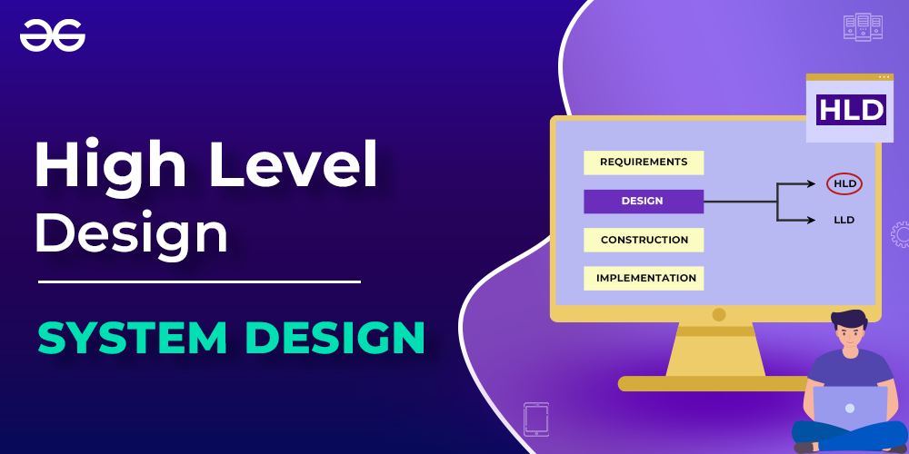
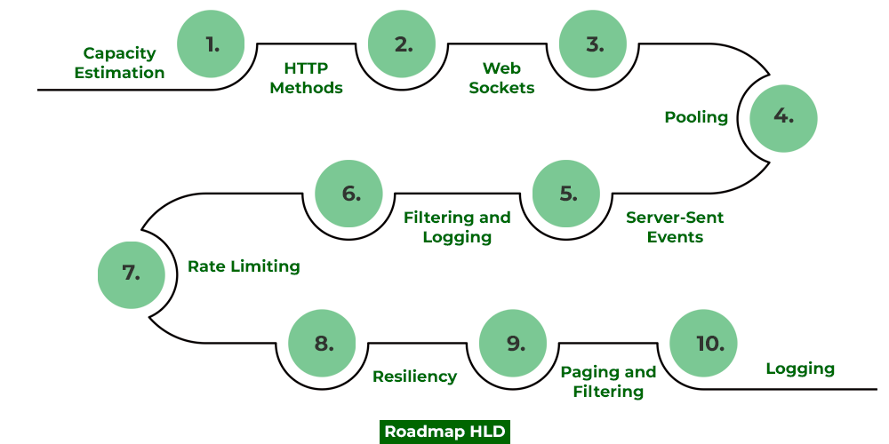
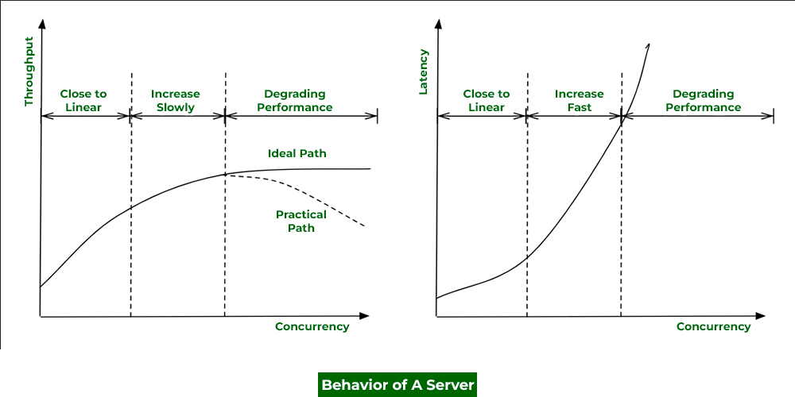
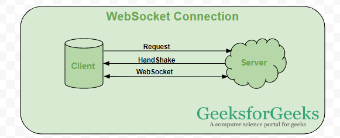
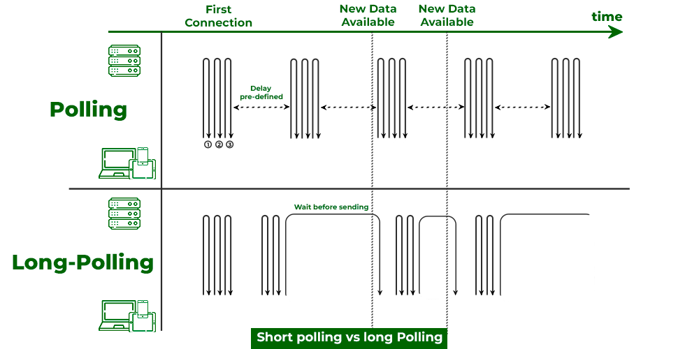
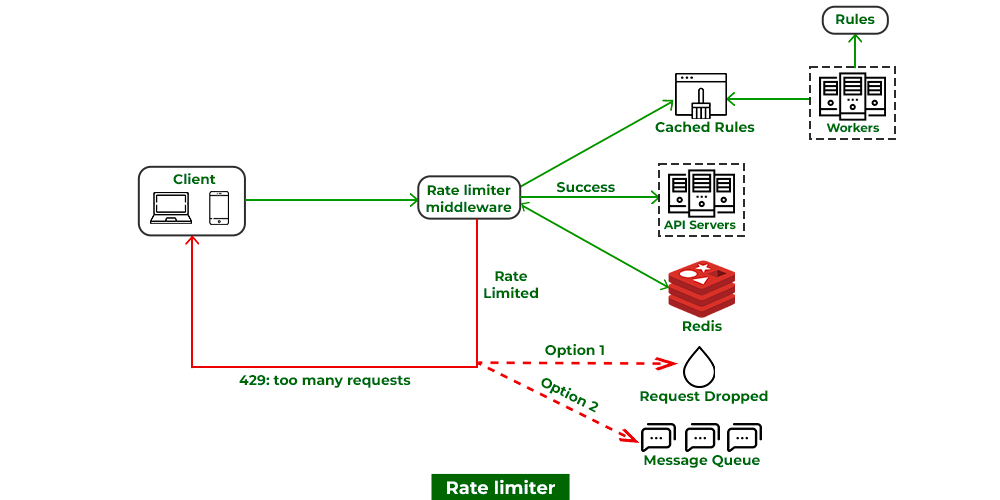
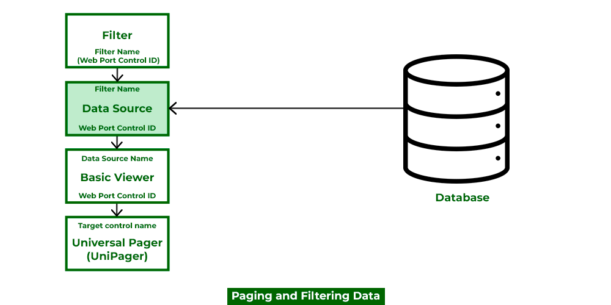

What is High Level Design – Learn System Design
===============================================

Last Updated : 02 Jan, 2024

**High-level design** or **HLD** refers to the overall system, a design that consists description of the system architecture and design and is a generic system design that includes:

*   System architecture
*   Database design
*   Brief description of systems, services, platforms, and relationships among modules.

> **High-level design** or **HLD** is also known as **macro level designing**.

*
What is High-Level Design
*

Important Topics for the High Level Design(HLD)

- [What is High Level Design – Learn System Design](#what-is-high-level-design--learn-system-design)
  - [**1. What is High-Level** Design **Document?**](#1-what-is-high-level-design-document)
    - [**Scope of High-Level Design Document** ](#scope-of-high-level-design-document)
  - [**2. Components of High-Level** Design](#2-components-of-high-level-design)
  - [**3. Purpose of High-Level Design**](#3-purpose-of-high-level-design)
  - [**4. Characteristics of High-Level Design**](#4-characteristics-of-high-level-design)
  - [**5. How HLD is different from LLD**](#5-how-hld-is-different-from-lld)
  - [6. How To Design Scalable High-level Design (HLD) Systems](#6-how-to-design-scalable-high-level-design-hld-systems)
    - [**6.1 Capacity Estimation**](#61-capacity-estimation)
    - [**6.2 HTTP and HTTPS and their methods**](#62-http-and-https-and-their-methods)
    - [**6.3 Web Sockets**](#63-web-sockets)
    - [**6.4 Polling**](#64-polling)
    - [**6.5 Server-Sent Events(SSE)**](#65-server-sent-eventssse)
    - [**6.6 Filtering**](#66-filtering)
    - [**6.7 Rate limiting**](#67-rate-limiting)
    - [**6.8 Resiliency**](#68-resiliency)
    - [**6.9 Paging**](#69-paging)
    - [**6.10 Logging**](#610-logging)

**1\. What is High-Level** Design **Document?**
-----------------------------------------------

> HLD document consists of **data flows, flowcharts, and data structures** to help developers in understanding and implement how the current system is being designed intentionally to function. 

This document is responsible for: 

*   explaining the connections between system components and operations which depict the logic
*   The architecture design needed (for the system’s functionality and flow) for each and every module of the system as per the functional requirements.
*   It is so because customer business requirements are transformed into solutions that we state as high-level designing as part of consulting work or architecture design, security, and networks.

> HLD **does not include** physical requirements, port details, VLAN, and many other details.

### **Scope of High-Level Design Document** 

The High-Level Design documentation presents the structure of the system as the application/database architecture, application flow, and technology architecture. High-Level Design documentation may use some non-technical terms, unlike low-level design which should be strictly technical jargon.

> **Note:** Making the HLD is the responsibility of **solution architects**. After creating HLD, now expert experienced designers move towards LLD in accordance with the HLD’s criteria. LLD will provide details about how software entities will work whereas HLD focuses only on what software entities to place in an organization for efficient operation.

Here below constraints are expected from solution architects while designing HLD:

1.  Gathering both functional and non-functional requirements
2.  Costing Limitations (It becomes an important pillar once the system for the organization scales up)
3.  Strong bounds over the degree of consistency, availability, scalability, and performance of a system. 

**2\. Components of High-Level** Design
---------------------------------------

For providing a bird’s eye view of the entire solution, HLD should be possessing 2 elements as follows:

1.  Attributes and features of software entities. 
2.  Relationships between different software entities (components, modules, classes, etc)

**Illustration:** Let us depict a high-level design via visual aid as shown below just to visualize the components and how the relationships are defined that is as follows: 

*
Components of High-Level Design
*

**3\. Purpose of High-Level Design**
------------------------------------

The purpose of this High-Level Design (HLD) is to add the necessary detailed description to represent a suitable model. This is designed to help with operational requirements and can be used as a reference manual for how the modules interact. Basically, HLD is a technical representation of functional requirements and the flow of information across assets or components.

**4\. Characteristics of High-Level Design**
--------------------------------------------

*   A diagram representing each design aspect is included in the All Design HLD (which is based on business requirements and anticipated results).
*   Description of hardware, software interfaces, and also user interfaces.
*   The workflow of the user’s typical process is detailed, along with performance specifications.
*   The project’s architecture and design are contained in Users HLD.

[**5\. How HLD is different from LLD**](https://www.geeksforgeeks.org/difference-between-high-level-design-and-low-level-design/)
---------------------------------------------------------------------------------------------------------------------------------

  

 

High-level Design

Low-level Design

Definition 

HLD is the overall architect description of a system.

LLD is a designing module-level description of a system.

Designing process

Overall level design process.

Component-level design process. 

Person involved

Solution architects

Designer and developers.

Conversion

Client requirements are being converted from a high-level design to as-per requirements.

Here it is been framed out for a detailed solution of the HLD.

Coding Involved.

No coding is involved in designing HLD.

Extremely detailed peculiar and specific code chunks snippets as per patterns are there while designing LLD.  

Let us now discuss the HLD roadmap after having an adequate understanding of HLD and how it is different from LLD which is shown below as an infographic: 

6\. How To Design Scalable High-level Design (HLD) Systems
----------------------------------------------------------

Now in order to design any high-level system, certain terms are listed in a sequential manner so as to connect the dots in order to understand, Roadmap is very important for working professionals because these help us to get a complete binding understanding of how services in real-time are getting scaled at a high level.

*
How To Design Scalable High-level Design (HLD) Systems
*

### **6.1 Capacity Estimation**

Capacity estimation in system design involves predicting the resources (such as processing power, memory, and bandwidth) required to meet the expected workload. It ensures that a system can handle current and future demands efficiently, helping in the proper allocation of resources and preventing performance bottlenecks.**For example:**

> Twitter which is recently in newsfeeds these days, here at high-level designing we need to make sure tweets of popular influencers are reaching out to millions of people so how we need to scale our system so service should not be hampered. 

We have also shown below the characteristics behavior of a server which is measured across throughput and latency within the system.

*
Comparison of Throughput and Latency with Concurrency : Behavior Of A Server
*

### **6.2 HTTP and HTTPS and their methods**

1.  GET
2.  PUT
3.  POST

> **Tip:** These are also important as per interview perceptive as constraint bounds in interviews in API over when to use what is very important. 

> **Tip:** There are 2 ways to send data from server to client:
> 
> *   Using Websockets
> *   Using Polling

### **6.3 Web Sockets**

In a [client-server architecture](https://www.geeksforgeeks.org/client-server-model/), we are sending a request to server and server sends it back and so in this way communication takes place. But in designing the system biggest problem we face is whether we can implement the client-server model because we can not wait until the server responds.Here Web Sockets play a crucial role that solving problems and enabling us to have real-time communication. They are more or less used in every system to be designed because we can not let our system wait for a response. They are very useful in Real-time web applications, gaming applications, chat applications.Features of WebSocket are:

*   **Full-Duplex Protocol**:
    *   WebSocket is a full-duplex protocol as it allows the application to send and receive data at the same time.
*   **Stateful Protocol**:
    *   It means the connection between server and client will not be terminated until and unless closed by any one of them either by the client or by the server. Once the connection is terminated from one end it is also closed by another end.
*   **3-way handshake**:
    *   Websocket uses a 3-way handshake also known as TCP connection for establishing communication between a client and server.

*
WebSocket Connection
*

### **6.4 Polling**

Polling is a technique of sending and receiving data from a server just likely as we do we doing above in the case of web sockets.

*
Short polling vs long polling 
*

In polling, we do have 2 types namely long polling and short polling.

*   In short polling, we sent the request. In short polling, the client sends a request to the server and the server immediately sends data at fixed intervals whether the data is updated or not.
*   In long polling, the server waits for the client’s request to respond and responds only and only if some new data is available or if some data is being updated.

> **Tip:** Long polling is preferred over short polling because lesser number of requests are sent in a system.

Now before proceeding further think of what will happen to the server if there is no request thrown by clients. We keep hold of this while designing systems.

### **6.5 Server-Sent Events(SSE)**

It is purposely built as one-way communication from servers to clients in specific design systems.**Example: Realtime streaming**

.png)*
Server-Sent Events(SSE)
*

### **6.6 Filtering**

The Control Room API supports filtering, pagination, and sorting for endpoints that return arrays of resources.The filtering mechanism filters the required resources, the sorting mechanism places the resources in order, and the pagination mechanism then returns a specific range of those ordered resources. This topic provides you with the details to filter and sort the results of API requests and also guides you to handling the pagination of large result sets returned from an API request.**Note:** Sorting and filtering are supported for substrings.**For example:**

> If you want to search for bots or files that have fin in their names, enter fin as the search criterion. All the bots and files that contain fin in the names will be displayed, for example, Finance, Finder, DeltaFinance, and Dolfin. Wildcards are not supported for searching and filtering bots or files.

**Filtering** allows you to apply Boolean conditions against a collection of returned resources in order to subset the collection to only those resources for which the condition is true. The most basic operation in Control Room API filters is to compare a field to a given value. It is possible to use equality comparison, range comparison, or logic. Use the following operators to compare a field to a constant value. 

### **6.7 Rate limiting**

A rate limiter restricts the number of events that can be done in a timeframe by restricting the number of requests a sender can send in a given period of time. Here once the threshold limit is reached now further it blocks the incoming requests as can be seen below media as follows:

*
Rate limiting
*

### **6.8 Resiliency**

No matter how great a system we design there is always a chance of faults and failure tolerance which could be because of hardware issues or software issues(such as running low on memory) or there can be some human error. In such cases we need to provide resiliency via below means as follows:

*   Replication
*   Redundancy
*   Availability

> **Note:** System design interviews starts with open ended designing a specific system which later is bounded with constraints at multiple levels. In order to clear dealing with these bounds in layman language is known as resiliency via implementing common trade-off in the system. Hence providing resiliency is very crucial in designing complex system designs and also in clearing interviews. 

### **6.9 Paging**

As studied above at the HLD phase we are not bothered about the code but we are very peculiar about database designing at this level so we keep track of how data is going to Now this concept comes into play at last designing high-level systems where we can not. Filtering, as the name suggests we are filtering specific desired data from the database on basis of requirements such as geographical factors.For example:

> Apple company, pages out desired which will filter out specific products as per the geographical location.

*
Paging
*

### **6.10 Logging**

A log file records details of events occurring in a software application. The details may consist of microservices, transactions, service actions, or anything helpful to debug the flow of an event in the system. Logging is crucial to monitor the application’s flow. This can also be useful for tracking the health and performance of a distributed system, as well as for debugging issues that may arise.There are several approaches to implementing distributed logging, including:

*   Using a centralized logging service
*   Using a distributed logging system
*   Using a cloud-based logging service

  

  

[Next](https://www.geeksforgeeks.org/system-design-horizontal-and-vertical-scaling/?ref=next_article)

[Horizontal and Vertical Scaling | System Design](https://www.geeksforgeeks.org/system-design-horizontal-and-vertical-scaling/?ref=next_article)
